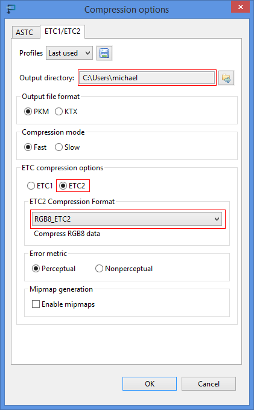
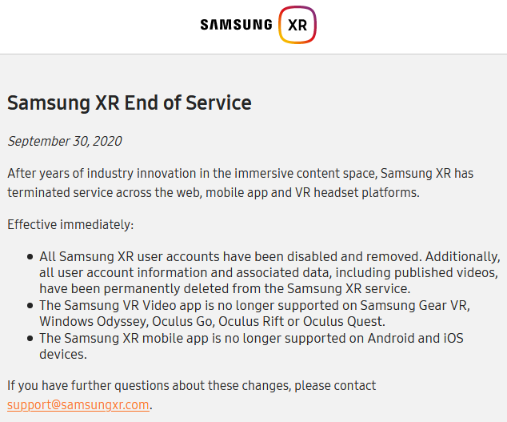

# Samsung VR Reference

I'm creating this repository as a quick reference for the Samsung VR video player (formerly MilkVR) in case they take [the page with this info](https://samsungvr.com/portal/content/faq_tech_gear_vr) down. (**Update:** They've taken the page down, along with all of their VR info, and discontinued support as of September 30, 2020. See screenshot at the bottom of this file.)

## Formats

| Video Format                          | Extension                         |
|--|--|
| 2D                                    | _2dp                              |
| 3D top/bottom                         | _3dpv                             |
| 3D left/right                         | _3dph                             |
| Monoscopic 180                        | 180x180                           |
| Monoscopic 16:9                       | 180x101                           |
| Left/right stereoscopic 180 16:9      | 180x101_3dh                       |
| Monoscopic 360 equirectangular        | _mono360                          |
| Top/bottom stereo 360 equirectangular | 3dv or _tv                        |
| Left/right stereo 360 equirectangular | 3dh or _lr                        |
| Monoscopic 360 cube                   | _cubemap                          |
| Top/bottom stereo cube                | _cubemap_tb                       |
| Left/right stereo cube                | _cubemap_lr                       |
| Monoscopic 360 octahedron             | _octahedron                       |
| Monoscopic 360 icosahedron            | _icosahedron                      |
| Top/bottom stereo 3D 180              | 180x180_3dv                       |
| Left/right stereo 3D 180              | 180x180_3dh                       |
| Left/right stereo 3D squished         | 180x180_squished_3dh              |
| Top/bottom stereo 3D 180x160          | 180x10_3dv                        |
| Two monoscopic 180 hemispheres        | 180hemispheres or 180-hemispheres |
| Top/bottom 3D cylinder 2.25:1         | cylinder_slice_2x25_3dv           |
| Top/bottom 3D cylinder 16:9           | cylinder_slice_16x9_3dv           |
| Top/bottom 3D 360 no bottom           | sib3d                             |
| 180 planetarium full dome             | _planetarium or _fulldome         |
| V360 camera                           | _v360                             |
| RTXP 360 cylindrical                  | _rtxp                             |

## Customization

The main room for Samsung VR can be modified by creating a cubemap from a 3D projected equirectangular image. A converter exists here: https://jaxry.github.io/panorama-to-cubemap/

Included is a Python script to rename the six output files into names Samsung VR understands (Front, Back, Left, etc.). If you don't feel like using Python or don't have it installed, the script is easy enough to follow for manual renaming.

Once they're renamed, you can use the [Mali Texture Compression Tool](https://developer.arm.com/products/software-development-tools/graphics-development-tools/mali-texture-compression-tool/downloads) to convert the images to ETC2 format (.pkm).

You can select multiple files and export them all at once. Pay particular attention to the output directory, which is specified in the Compression Options window:

Place the final .pkm files into the SamsungVR or MilkVR folder on the root of the device.

## Samsung Official Discontinuation
